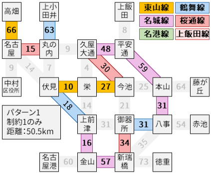

# 名古屋市営地下鉄の最長定期券をGLPKを使って求める

2019.3.16 H.Hiro (main@hhiro.net)

## この問題を解いてみようと思った経緯

Twitterで見かけたので。  
https://twitter.com/chaostrain/status/1093067564907778048  
https://peing.net/ja/q/ba601325-af4e-4566-8d7d-4bba4b75f329

結論としては、上記のカオストレインさんの経路が最長で、この経路でした。


## 問題設定

名古屋市営地下鉄の定期券は、以下のルールで発行されます。

> 地下鉄の定期券は「一筆書き」で描ける経路で乗換が3回以内なら、お客様の便利な経路を選んで購入できます。  
> 経路が交差したり、駅が重複する場合は発売できません。  
> [定期券の購入方法 | 定期券 | 乗車券 | 名古屋市交通局](https://www.kotsu.city.nagoya.jp/jp/pc/TICKET/TRP0000283.htm)

基本的には「最長片道切符」の算出を線形整数計画ソルバーで解く方法（参照：[最長片道きっぷの経路を求める](http://web.archive.org/web/20180406161900/http://www.swa.gr.jp/lop/index.html)）と同様なのですが、「乗換が3回以内」という最長片道切符にはない制約があり、そこを自前で線形制約として記述しました。

## はじめに：線形整数計画問題

例えば[整数計画法 IP アルゴリズム 入門](http://www.msi.co.jp/nuopt/introduction/algorithm/ip.html)の記事をご覧ください。

線形整数計画問題は以下のようなクラスの最適化問題です。

- 線形計画：
  - 制約式は変数についての1次式（変数×定数 + 変数×定数 + … とかけなければならない）の等式ないし不等式のみ
  - 最大化ないし最小化したい式も、変数についての1次式
- 整数計画：
  - 動かせる変数は所定の範囲の整数（今回は「0か1」のみ利用）

整数という条件がなければ、効率よく解けることが知られています。また整数という条件が入った場合でも、（あまりに大きい問題は難しいですが）まず事前に整数という条件なしで問題を解いてから整数の解を得るという方法で解くことができ、そのためのソルバーも各種開発されています。

## 定式化

名古屋市営地下鉄の路線網はこんな具合です。それぞれの辺（線）には数字が書かれており、これが営業キロ（×0.1km）です。


このとき、それぞれの辺`e`を使うか使わないか決めたいわけなので、そのことを線形整数計画問題の変数`SEC[e]`とします。ここでは辺を使うことを1、使わないことを0とします。そのうえで、定期券が買える条件（これはここから考えていきます）を満たすものの中で辺の長さ（営業キロ）の総和が最大になるような変数を求めればよいわけです。つまり、

max<sub>SEC[e]∈{0, 1}</sub> &Sigma;<sub>e∈路線網のすべての辺</sub> w[e]・SEC[e]  
subject to (SEC[e]に合わせて辺を引くと定期券が買える条件を満たしている)

という問題を解きたいのです。ただし`w[e]`は辺の長さです。最大化したい式が1次式なのは明らかなので、あとは制約式として「定期券が買える条件」を1次式で書きたいわけです。

## 制約式

### 制約1：それぞれの駅を通る回数の制約

同じ駅を二度通らない一筆書きができるためには、少なくとも以下の条件「パターン1」が必要です（半オイラー路）。

- パターン1
  - どの駅についても、その駅を通る辺は高々2つしか使わない。
  - 通る辺がちょうど1つであるような駅は、2つまでしか存在できない[^1]。

しかしここでは追加で、条件付きで同じ駅を二度通ることも許す一筆書きである、以下のパターンも考えます。

- パターン2
  - どの駅についても、その駅を通る辺は高々**3つ**しか使わない。
  - 通る辺がちょうど**3つ**であるような駅は、**1つまでしか存在できない**。
  - 通る辺がちょうど**1つ**であるような駅は、**1つまでしか存在できない**。
- パターン3
  - どの駅についても、その駅を通る辺は高々**3つ**しか使わない。
  - 通る辺がちょうど**3つ**であるような駅は、**2つまでしか存在できない**。
  - 通る辺がちょうど**1つ**であるような駅は、**存在してはならない**。

なぜかというと、今回は他路線との接続駅に限って頂点を設けているので、本当はこのようなルートが最長であった場合に、それを検出できないためです。パターン2は下図のように「辺単位で考えると同じ駅（この図では八事）を2回通るのだが、実際にはそこから1駅縮めた経路が最長」という駅が1つだけ存在するケース、パターン3はそれが2つ存在するケースに対応します。


さて、これらを実現するために追加の0-1変数を導入します。

- `EME[t][m]`：駅`t`を`m`回以上通っているなら1。そうでなければ0。

これは、`EME[t][m]`が0か1しか選べないと設定したうえで、以下の制約式を書くことで実現できます。

- `m > deg(t)`ならば、
  - `EME[t][m] = 0`
- `m <= deg(t)`ならば、
  - `(SEC[e_t1] + SEC[e_t2] + ...) <= deg(t) * EME[t][m] + m - 1`  
    （駅`t`を`m`回以上通っているなら`EME[t][m]`は1、**そうでなければ0でも1でもよい**）
  - `(SEC[e_t1] + SEC[e_t2] + ...) >= m - deg(t) * (1 - EME[t][m])`
    （駅`t`を`m`回以上通っているなら`EME[t][m]`は**0でも1でもよい**、そうでなければ0）

ただし、`e_t1`, `e_t2`, ...は「駅`t`に繋がる辺すべて」、`deg(t)`は次数（駅`t`に繋がる辺の数）です。

このような変数を導入しておくことにより、制約条件は以下のように書けます。

- パターン1の場合
  - 任意の駅`t`について、`EME[t][3] = 0`
  - `(EME[t_1][1] + EME[t_2][1] + ...) - (EME[t_1][2] + EME[t_2][2] + ...) <= 2`
- パターン2の場合
  - 任意の駅`t`について、`EME[t][4] = 0`
  - `(EME[t_1][3] + EME[t_2][3] + ...) - (EME[t_1][4] + EME[t_2][4] + ...) <= 1`
  - `(EME[t_1][1] + EME[t_2][1] + ...) - (EME[t_1][2] + EME[t_2][2] + ...) <= 1`
- パターン3の場合
  - 任意の駅`t`について、`EME[t][4] = 0`
  - `(EME[t_1][3] + EME[t_2][3] + ...) - (EME[t_1][4] + EME[t_2][4] + ...) <= 2`
  - `(EME[t_1][1] + EME[t_2][1] + ...) - (EME[t_1][2] + EME[t_2][2] + ...) <= 0`

ただし、`t_1`, `t_2`, ...はすべての駅について続くことを意味します。

これを解いてみると、そもそも一筆書きすらできない、二つの経路に分かれてしまうような結果（非連結）も現れてしまいました。「各駅を通る辺の数」のみに着目したのでは、これでも条件は満たしてしまうのです。

  

ここで最長片道切符を得るときの記事では、「連結になるような辺を少なくとも一つ含む」という制約を追加して解き直すということをするのですが、ここではまずそれは横においておいて、別に必要な「乗換回数の制約」を入れてみましょう。

### 制約2：乗換回数の制約

ここで、変数`EME`を導入したときと同様の要領で、「乗換をしたときに1、そうでないときに0」という変数を導入します。  
`CHANGE[a-b-c]`で、a駅-b駅-c駅という経路を通った（「a-b」「b-c」の辺をともに利用した）ときに1、そうでないとき0である変数とします。ただしa-bとb-cは別の路線に属しているとします。このとき、`CHANGE[a-b-c]`全部を足し合わせた値が、パターン1では3以下であればよいです。ただパターン2では5まで許容する必要があります（下図）。同様の理由で、パターン3も7まで許容する必要があります。


なお`CHANGE[a-b-c]`の値を適切に設定するには、以下のような制約をかけばよいです。

`0 <= SEC[a-b] + SEC[b-c] - 2 * CHANGE[a-b-c] <= 1`

この制約式を、「a-bとb-cが異なる路線であるようなすべての組み合わせ」について書けばよいです。具体的には、すべての辺が何駅を通っているかで分け（よって1つの辺は2つの駅に現れる）、さらに路線別に分け、二つの辺の組で相異なる路線同士であるものすべてについてこの制約式を書きます。例えば伏見駅だと、東山線に属する「名古屋-伏見」「伏見-栄」と、鶴舞線に属する「丸の内-伏見」「伏見-上前津」の4つの辺があるので、

- `0 <= SEC[名古屋-伏見] + SEC[丸の内-伏見] - 2 * CHANGE[名古屋-伏見-丸の内] <= 1`
- `0 <= SEC[名古屋-伏見] + SEC[上前津-伏見] - 2 * CHANGE[名古屋-伏見-上前津] <= 1`
- `0 <= SEC[栄-伏見] + SEC[丸の内-伏見] - 2 * CHANGE[栄-伏見-丸の内] <= 1`
- `0 <= SEC[栄-伏見] + SEC[上前津-伏見] - 2 * CHANGE[栄-伏見-上前津] <= 1`

のようになります。

この制約を入れて解くと、

  

こんなルートが出てきました。ここで注目したいのは、**どのパターンでも、一筆書きの制約を明示的に入れたわけではないのだが、偶然にも一筆書きの経路が得られたこと**です。一般に、新たな制約を入れて最適化の結果が改善されることはありえないので、ここからわざわざ一筆書きの制約を入れなくとも、パターン1で一筆書きの最長経路はこれだとわかるのです。またパターン3は実際には乗換回数の制約を満たしていませんが、ということはパターン3での最長経路は必ずこれ以下であるので、パターン1やパターン2より短いのでもはや解き直す必要はありません。

以上の結果から、パターン1で解いた以下の経路（46.0km）が最長経路だと確定できます。

**上小田井 - (鶴舞線) - 御器所 - (桜通線) - 久屋大通 - (名城線 大曽根・八事経由) - 金山 - (名港線) - 名古屋港**

ちなみに名城線は東別院・矢場町・栄以外の全駅が利用可能です。<del>でも矢場町や栄が利用できないのは使い勝手悪そうですね…上前津と久屋大通こそ使えるとはいえ</del>

## 実際に問題を解くのに使ったファイル

線形整数計画問題のソルバーとして今回は[GLPK](https://www.gnu.org/software/glpk/)を使っています。GLPKが読み込める問題設定のファイル形式の一つであるMathProg形式のファイル（拡張子：`.mod`）と、それを生成するのに用いたC++のコード（gccで動作確認しています。gccとmakeコマンドが利用可能であれば、そこから実行ファイルを生成できます）を配布します。コマンドライン版のGLPK（glpsol）であれば、以下のように実行できます。

```sh
$ glpsol -m p1c2.mod
```

なお問題設定のファイルは、「`p[パターン]c[制約].mod`」としています。

（なぜC++で書いたのかというと、当初はGLPKの関数をC++から直接呼び出すつもりだったのでした。それがどうもうまくいかず、制約条件等を計算する部分をそのまま残して、GLPKに渡すスクリプトを出力するように変更したのでした）

## （2024.2.7追記）名城線と名港線の直通は乗り換え回数にカウントされないことを考慮した計算結果

思い立って、名城線と名港線の直通（図中の「名古屋港-金山-上前津」）で利用する場合は乗り換え回数にカウントされないかも？と確認したところ、やはりされないようでした[^2]。実際、[名古屋市交通局の定期券料金検索](https://www.kotsu.city.nagoya.jp/jp/pc/subway/price_list.html)では、「名古屋港→(金山)→栄→本山→八事→赤池」という定期券は購入可能でした。

そこで以下のような変更をして再計算をしました。

-   名港線も、乗り換え回数の計算（`CHANGE`変数の作成）においては、名城線と同一路線とみなす。
-   そのうえで、名古屋港を通ることを必須としたうえで、最長経路を求める。
    -   このとき、名古屋港駅が行き止まりであるため、パターン3は不可能である。パターン1と2だけ計算すればよい。

これを求めると、

 

と、パターン2はすでに求めていた最長経路（46.0km）より短いですが、パターン1はより長い47.0kmの経路が出てきました。しかしこの47.0kmの経路は、名古屋市交通局の定期券料金検索で、購入できないことが確認されました。

そこで「この経路と完全一致するもののみ除外した」最長経路を（パターン1に限って）計算すると、次に出たのは以下の46.1kmの経路でした。しかしこれも名古屋市交通局の定期券料金検索で、購入できないことが確認されました。


さらにもう一度、同じ経路を除外して最長経路を計算すると、もともと求めていた46.0kmの経路が出ました。これにより、最初に求めた46.0kmの経路が実際に最長であると確認できました。

[^1]: 本当であれば「存在しない、またはちょうど2つ存在していなければならない」となるべきなのですが、グラフ理論でいうところの「握手補題」により、1個ということはありえないことが証明できます。

[^2]: そう考えた根拠として、2004年の名城線の環状化以前は、現在の名港線の区間が名城線の一部と扱われていた、というのがあります（代わって、金山～新瑞橋が「4号線」と呼ばれていた）。
